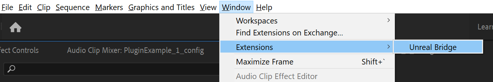
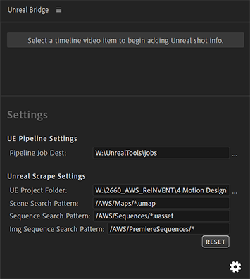
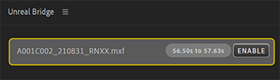
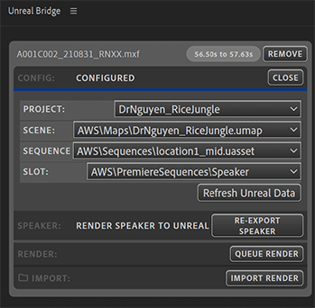

# Premiere Pro Unreal Bridge plugin

This plugin is a video production tool for integrating an Unreal Engine render pipeline into Adobe Premiere Pro.

It allows a Premiere Pro users to easily replace clips in their sequence with renders from UE, including compositing a 'speaker' track from Premiere into the Unreal scene (optional).

UE renders are sent to the [Unreal render pipeline](https://bitbucket.org/imagination/aws-unreal-renderpipeline), which can be running on another PC (or multiple PCs) with access to the same network drive. At the moment, this is the only supported render backend, so the pipeline must be running for this plugin to work.

The basic steps:

- User selects a clip in sequence, and tags the clip with a UE Project, Scene and Level Sequence.
- Optionally, can then export the clip as an image sequence into the UE project for in-engine composition (must set up the UE project to support this, details below).
- Click to render the UE scene via the pipeline
- Click to import the resulting image sequence back into PP (will be placed in the sequence, at the correct time, in a new video track).

## Installation

To install the plugin, download the latest ZXP file from the [Downloads page](https://github.com/TomByrne/premiere-unreal-bridge/releases) and install it using one of the following installers:

- [Anastasiy’s Extension Manager](http://install.anastasiy.com/)
- [ZXPInstaller](https://zxpinstaller.com/)
- [Adobe Extension Manager CC (legacy)](https://www.adobe.com/exchange/em_download/)

After restarting Adobe Premiere, the plugin should now be available (Window > Extensions > Unreal Bridge):



## Settings

Before using the plugin for the first time, there are several settings that should first be configured.

> Note that when these settings use a shared network drive (`W:` in the example below), any PCs running the UE pipeline should have access to the same drive, mapped to the same letter.

To open the settings panel, click the small cog icon at the bottom-right of the plugin:



- **Pipeline Job Dest:** This is the path the the job folder that the UE pipeline is watching. By default, this is a folder named 'jobs' nest to the UE pipeline.
- **UE Project Folder:** This should point to the folder which stores all of you UE projects. This will be used to generate a list of projects in the plugin's UI.
- **Scene Search Pattern:** Within each UE project, this pattern will be used to find UE Scenes.
- **Sequence Search Pattern:** Within each UE project, this pattern will be used to find UE Animation Sequences.
- **Img Sequence Search Pattern:** Within each UE project, this pattern will be used to find image sequence folders. These are the folders where PP image sequences can be written to for composition in UE. The UE project must be properly configured to use these sequences. This option will only show up if image sequence folders were found in the UE project.

> Each of the patterns above accepts wildcards. Use a single asterisk (*) to match within a folder, or a double asterisk (**) to searh deeply through folders. See more about Glob pattern matching [here](https://www.npmjs.com/package/glob).

> **Warning:** Making any of the patterns above too broad will impact the time it takes to scrape the UE projects. It is recommended to keep all of your assets within a common folder to avoid the scraper searching through 3rd-party asset folders (`AWS` in the above example).

## Usage

To use the plugin, open your seqeunce and select the clip that you wish to replace with a UE render. Use the Unreal Bridge panel to enable the item for configuration. Press the 'Enable' button.



Now the item is configurable, select the UE project, scene and sequence you wish to use. If the UE project supports Image Sequences, you should also select the 'slot' / 'image sequence' to export the PP image sequence to.

Once fully configured, the config panel shold go blue and more options will show up:



- **Refresh Unreal Data:** This button re-scrapes the Unreal projects folder. Use this if you've made changes to an Unreal project since starting Premiere.
- **Export Speaker:** This button exports the track item as an image sequence into the selected image sequence folder in the UE project. This section only shows up if the UE project supports it.
- **Queue Render:** This button sends the configured render into the UE render pipeline. As mentioned above, if there are no pipeline nodes running, the render will stay in the queue indefinitely. Otherwise, the plugin will display the progress of the render in the UI.
- **Import Render:** This button imports the image sequence that was rendered by the UE render pipeline back into PP. The imported image sequence then gets dropped into the original sequence, at the correct time, but in a new video track.


## Limitations

- Currently the speaker export from PP to UE is fairly inflexible. The settings for this export are controlled by an [epr file](./epr/png_export_4k.epr) that is bundled into the plugin. This sequence is always 30fps at 4k resolution. Also, when the image sequence is re-imported, it comes back in as 30fps (see [ImageSlotTools](./src_backend/src/ImageSlotTools.ts)).
- While the UE render pipeline itself is very flexible for configuration, this plugin doesn't expose much of that flexibility at this point. Most of the configuration is hardcoded in [PipelineJobUpdater](./src_frontend/src/logic/PipelineJobUpdater.ts).


## Development Setup
> Due to Adobe's CEP system, it's not possible to set this project up for development on a network drive.

### Prerequisites:
- [Node.js](https://nodejs.org/en/download/)
- Yarn `npm install --global yarn`

### Point Adobe Premiere to your local checkout:

- Open an Powershell / Terminal window
- Navigate to this project folder
- Run `yarn` to install tooling dependencies
- Run `yarn link-premiere` (or `node .scripts/link-premiere.js`)
- Confirm the Admin dialog when it asks (Windows only)

If this folder already exists, this script will fail, uninstall the plugin or delete the folder and rerun the script.

- Win: `C:\Users\<USERNAME>\AppData\Roaming\Adobe\CEP\extensions\tbyrne.unreal.bridge`
- Mac: `~/Library/Application Support/Adobe/CEP/extensions/tbyrne.unreal.bridge`

This will set up a symlink from the Adobe extensions folder into this repo, allowing you to work from the same directory that Premiere is watching.
You will need to restart Premiere if it was already running, to detect the new extension.

### Start development servers

Before opening the panel in Premiere you'll need to start the development servers.

Run `yarn serve` to start both the backend and frontend development servers.

If either server is killed, the other will also exit.

### Open Plugin

It should now be possible to open the plugin in Premiere.

- In the Premiere menu bar, go to Window > Extensions > Unreal Bridge
- Initially, the pre-built version of the frontend will load, click the localhost:8080 link to navigate to the hot-reload version.

## Build Plugin:
See general Premiere plugin build instructions [here](https://github.com/Adobe-CEP/Samples/tree/master/PProPanel).

> When building on a platform other than Windows, you'll need to install [ZXPSignCMD](https://github.com/Adobe-CEP/CEP-Resources/blob/master/ZXPSignCMD) on the Path.

Run:
```sh
yarn full-build
```

## Goals:

1. Cleanup existing sequence

  - Copy sequence (optionally)
  - Validate FPS (optionally)

2. Create Unreal track in sequence

  - Choose 'speaker' track/s
  - Create new track
  - Create image sequence project items for each quality level (2?)
  - Create new sequence with layers for each of these image sequences
  - Create track items in edit sequence using this sequence

3. Trigger UE pipeline render

  - Write JSON file/s based on sequence start/end + settings
  - **Show rendered frames as they complete from UE** (may require refresh in jsx)

4. Export Speaker tracks to UE (if possible)

  - Create 4k / 30fps sequence from edit sequence
  - Remove transforms / scale to fill frame
  - Export frames to standard path in UE proj